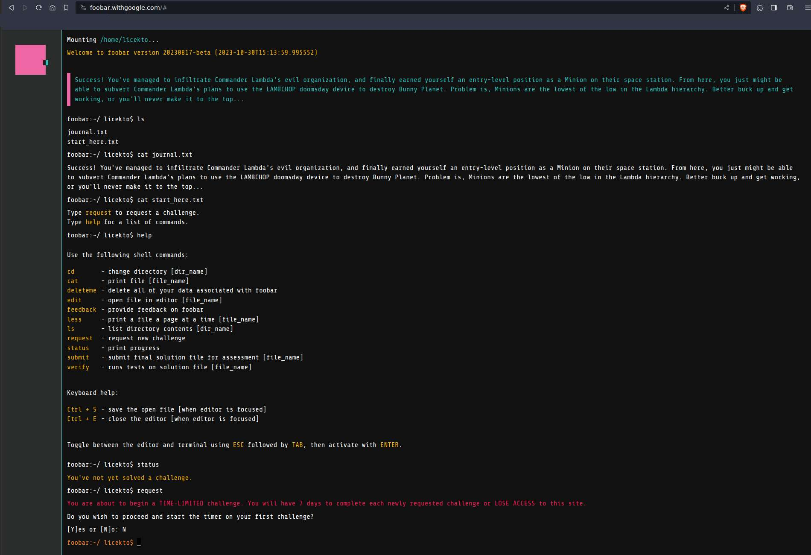
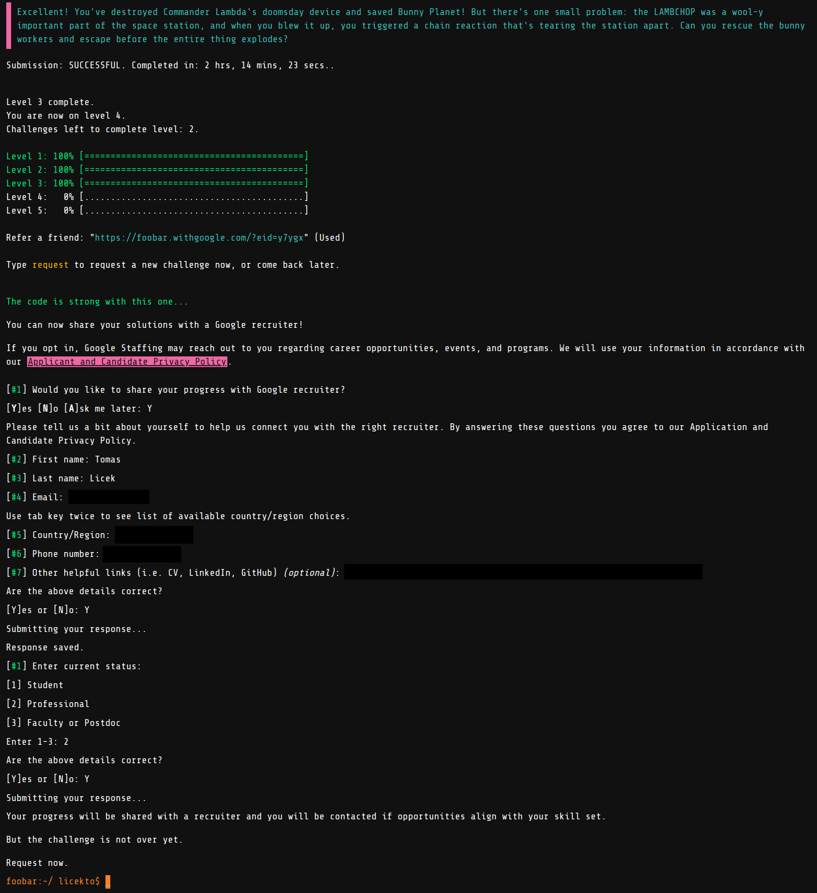

# Google foobar challenge

Can be found at [foobar.withgoogle.com](https://foobar.withgoogle.com).

Invite from a friend is needed or will appear after some particular google search:

The browser interface:

# Description

Five levels, various topics:

* Dynamic programming
* Greedy algorithms
* Graph search

Can be solved in Java or Python.

# General constraints

## Java
Your code will be compiled using standard Java 8. All tests will be run by calling the solution() method inside the Solution class

Execution time is limited.

Wildcard imports and some specific classes are restricted (e.g. java.lang.ClassLoader). You will receive an error when you verify your solution if you have used a restricted class.

Third-party libraries, input/output operations, spawning threads or processes and changes to the execution environment are not allowed.

Your solution must be under 32000 characters in length including new lines and other non-printing characters.

## Python
Your code will run inside a Python 2.7.13 sandbox. All tests will be run by calling the solution() function.

Standard libraries are supported except for bz2, crypt, fcntl, mmap, pwd, pyexpat, select, signal, termios, thread, time, unicodedata, zipimport, zlib.

Input/output operations are not allowed.

Your solution must be under 32000 characters in length including new lines and other non-printing characters.

# Journal

Success! You've managed to infiltrate Commander Lambda's evil organization, and finally earned yourself an entry-level position as a Minion on their space station. From here, you just might be able to subvert Commander Lambda's plans to use the LAMBCHOP doomsday device to destroy Bunny Planet. Problem is, Minions are the lowest of the low in the Lambda hierarchy. Better buck up and get working, or you'll never make it to the top...

Why did you sign up for infiltration duty again? The pamphlets from Bunny HQ promised exotic and interesting missions, yet here you are drudging in the lowest level of Commander Lambda's organization. Hopefully you get that promotion soon...

You survived a week in Commander Lambda's organization, and you even managed to get yourself promoted. Hooray! Henchmen still don't have the kind of security access you'll need to take down Commander Lambda, though, so you'd better keep working. Chop chop!

You got the bunny trainers to teach you a card game today, it's called Fizzbin. It's kind of pointless, but they seem to like it and it helps you pass the time while you work your way up to Commander Lambda's inner circle.

Rumor has it the bunny trainers are inexplicably fond of bananas. You're an apple person yourself, but you file the information away for future reference. You never know when you might need to bribe a trainer (or three)...

Awesome! Commander Lambda was so impressed by your efforts that you've been promoted to personal assistant. You'll be helping the Commander directly, which means you'll have access to all of Lambda's files -- including the ones on the LAMBCHOP doomsday device. This is the chance you've been waiting for. Can you use your new access to finally topple Commander Lambda's evil empire?

There are a lot of difficult things about being undercover as Commander Lambda's personal assistant, but you have to say, the personal spa and private hot cocoa bar are pretty awesome.

One of these days you're going to manage to glimpse Commander Lambda's password over their shoulder. But the Commander is very careful about security and you haven't managed it yet...

Who the heck puts clover and coffee creamer in their tea? Commander Lambda, apparently. When you signed up to infiltrate the organization you didn't think you'd get such an up-close and personal look at these more... unusual tastes.

Excellent! You've destroyed Commander Lambda's doomsday device and saved Bunny Planet! But there's one small problem: the LAMBCHOP was a wool-y important part of the space station, and when you blew it up, you triggered a chain reaction that's tearing the station apart. Can you rescue the bunny workers and escape before the entire thing explodes?

Not all of the bunny workers are highly-trained operatives. Some of them are civilians, and they're panicking in all the noise and confusion of the space station's destruction. Several of them have wedged themselves into corners and started thumping, which isn't exactly helping the station's structural integrity...

# Offer

